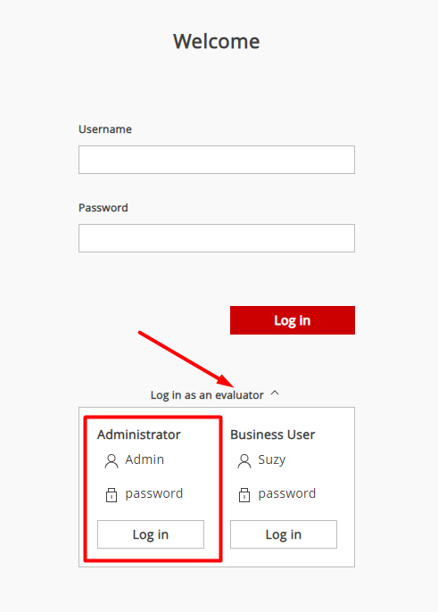

# Instalação Servidor Pentaho Community em Container Proxmox com Ubuntu 20.04

## Instale o Ubuntu 20.04 em um novo container em PROXMOX a partir do template.


> 1. Após instalado o ubuntu 20.04 no container novo, atualize o mesmo.

```txt

sudo apt update
sudo apt upgrade


```
---

> 2. Instale o pacote de rede do ubuntu

```txt

apt install net-tools

```

---

> 3. Instale as dependências necessárias para o Pentaho Community Edition: 

```txt

sudo apt install default-jre unzip

```

---

> 4. Baixe o arquivo zip do Pentaho Community Edition: A fonte para esse donwload esta em https://www.hitachivantara.com/en-us/products/pentaho-platform/data-integration-analytics/pentaho-community-edition.html, sempre verificar se mudou a versão para o download.

```txt

wget https://privatefilesbucket-community-edition.s3.us-west-2.amazonaws.com/9.4.0.0-343/ce/server/pentaho-server-ce-9.4.0.0-343.zip


```

---

> 5. Descompacte o arquivo (zip):

```txt

unzip pentaho-server-ce-${version}.zip

```

---

> 6. sudo mv pentaho-server /opt/

```txt

sudo mv pentaho-server /opt/

```

---

> 7. Defina as permissões corretas: coloquei como root o usuario.

```txt

sudo chown -R user:user /opt/pentaho-server/

```

---

> 8. Inicie o Pentaho Server:

```txt

cd /opt/pentaho-server/
./start-pentaho.sh

```

> 9. Verifique o ip do container para poder acessar o pentaho

```txt

ifconfig

```

---

> 10. Em uma máquina Windows na mesma rede, abra um navegador da web (por exemplo, Google Chrome ou Mozilla Firefox) e digite o endereço IP do contêiner Ubuntu seguido da porta 8080 (ou a porta que você tenha configurado para o Pentaho Server, se for diferente da padrão):

```txt

http://endereco_ip_container:8080/pentaho

```

---

> 11. Em teoria o usuario padrão é admin senha admin, mas nao consegui entrar, a nao ser através do evaluator que ao meu ver é para avaliação.

<div align="center">
    
</div>

---

> 12. Mudar porta padrão do Pentaho: Navegue até o diretório onde o Pentaho está instalado. Se você seguiu os passos anteriores, o diretório deve ser /opt/pentaho-server/. Dentro desse diretório, você encontrará o arquivo server.xml, que precisa ser editado. Use o editor de texto nano, vim ou gedit, ou qualquer outro editor com o qual você se sinta confortável:

```txt

sudo nano /opt/pentaho-server/tomcat/conf/server.xml

```

---

> 13. No arquivo server.xml, procure por uma linha que se parece com esta: e altere para a porta desejada.

```txt

<Connector port="8080" protocol="HTTP/1.1"
           connectionTimeout="20000"
           redirectPort="8443" />

```

---

> 14. Salve as alterações no arquivo e feche o editor. Reinicie o Pentaho Server para que as alterações entrem em vigor:

```txt

cd /opt/pentaho-server/
./stop-pentaho.sh
./start-pentaho.sh

```

> 15. Alterar o padrão de upload dos arquivos para tratamento de ETL. Se você estiver recebendo a mensagem "file too big to upload" (arquivo muito grande para fazer upload) ao tentar abrir um arquivo de texto (txt) no Pentaho, provavelmente está atingindo um limite de tamanho de arquivo definido no Pentaho.

```txt

sudo nano /opt/pentaho-server/tomcat/webapps/pentaho/WEB-INF/web.xml

```

---

> 16. Essa documentação fala sobre o aumento de upload dos arquivos. https://help.hitachivantara.com/Documentation/Pentaho/9.2/Setup/Customize_the_Pentaho_Server: vá ate /pentaho-server/pentaho-solutions/system and open the pentaho.xml file.

```txt

01
<file-upload-defaults>
<relative-path>/system/metadata/csvfiles/</relative-path>
<!-- max-file-limit is the maximum file size, in bytes, to allow to be uploaded to the server -->
<max-file-limit>10000000</max-file-limit>
<!-- max-folder-limit is the maximum combined size of all files in the upload folder, in bytes. -->
<max-folder-limit>500000000</max-folder-limit>
</file-upload-defaults>

```

---

> 17. Reinicie o Pentaho para aplicar as configurações.

```txt

cd /opt/pentaho-server/
./stop-pentaho.sh
./start-pentaho.sh

```

